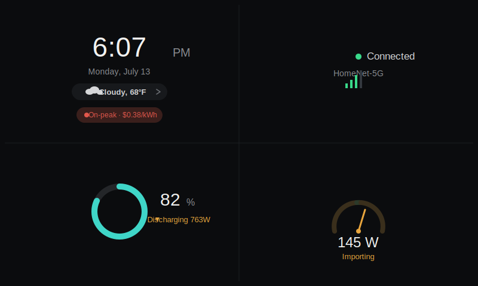
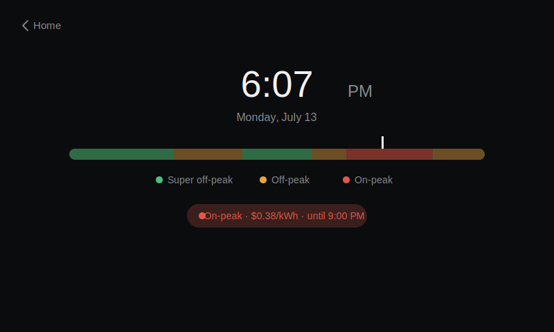
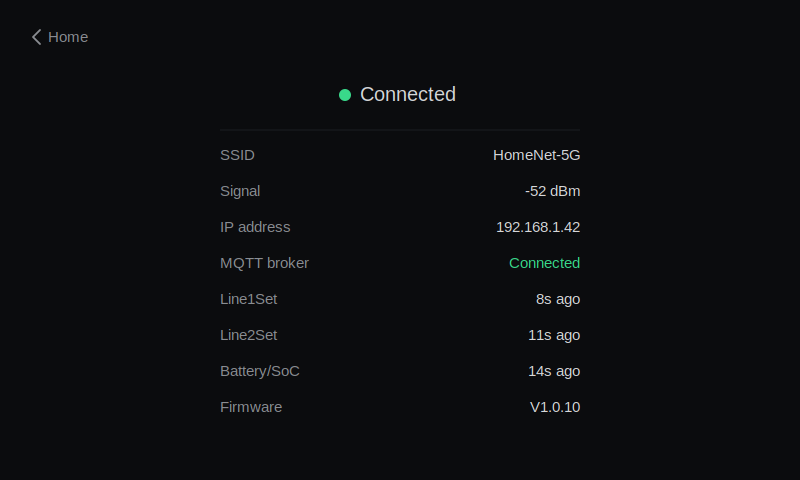
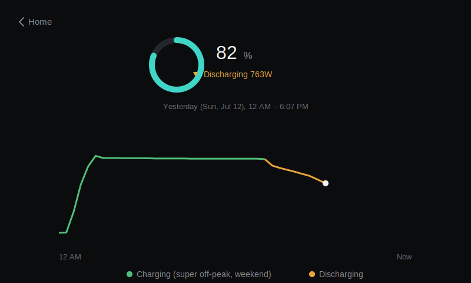
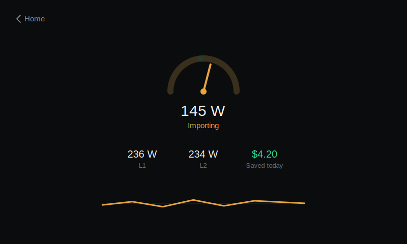
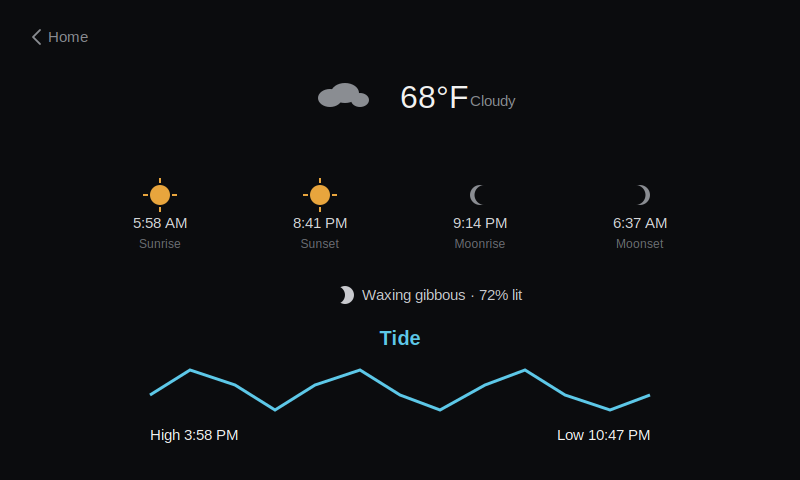

Purpose: This controls power flow to a home based on time-of-use rates that
  can vary as much as 8x from peak to off-peak. Thus it can act as an arbitrator
  of power rates for a household with appropriate hardware. THe Y-H hardware is
  designed out-of-the-box to feed power from downstream current monitoring. This
  is not an easy connection in the US grid because the current monitor really
  needs to be upstream at the panel. Thus the math and control system are different,
  and it needs a signed value of power flow to maintain levels of export close
  to zero.

## Planned dashboard (design mockups)

A touch-navigable redesign of the display is planned — a minimal Home
screen plus five detail screens reachable by tapping. These are design
mockups only; nothing below is implemented in the firmware yet. Full
writeup: [`design/lvgl_redesign_plan.md`](design/lvgl_redesign_plan.md).
An interactive, clickable version of all six screens is also available
at [`design/mockups/giga_dashboard_mockup.html`](design/mockups/giga_dashboard_mockup.html).

**Home** — clock, weather, time-of-use status, connection status, battery, and net grid flow at a glance:

**Time & rates** — full time-of-use schedule, color-coded super off-peak/off-peak/on-peak:

**Connection** — network and MQTT status, including per-topic last-seen freshness:

**Battery** — charge state and a day's SoC curve, colored by charge (super off-peak) vs. discharge:

**Grid flow** — net import/export, L1/L2 breakdown, today's savings:

**Almanac** — weather, sunrise/sunset, moon phase, tide (reached by tapping the weather row on Home):

