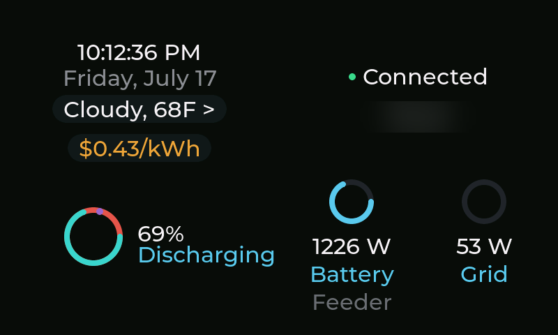
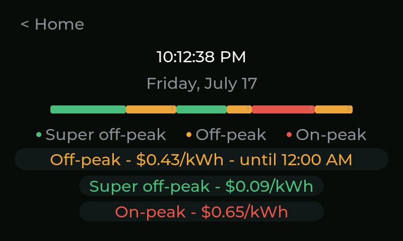
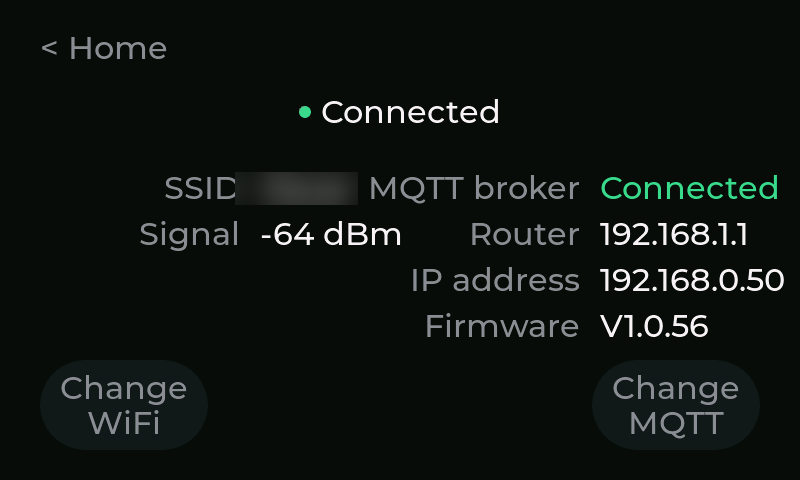
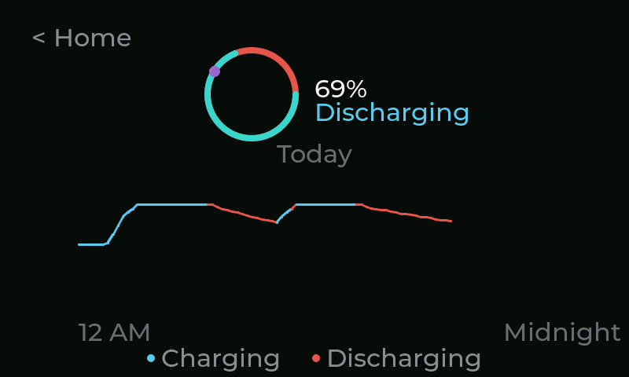
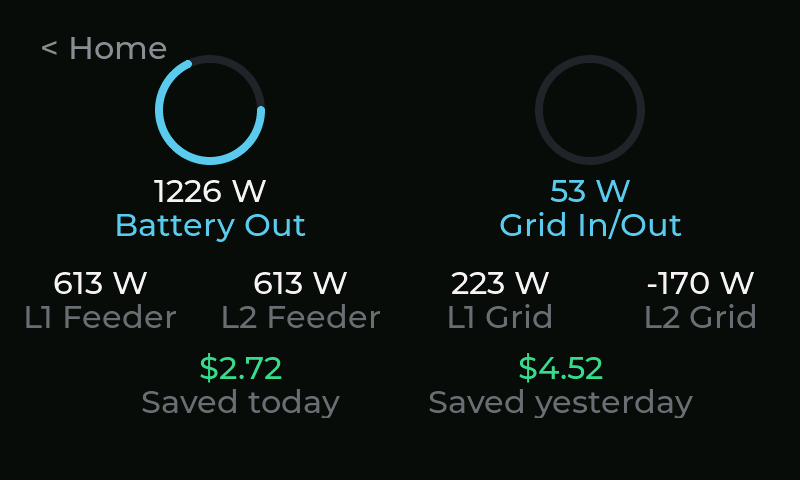
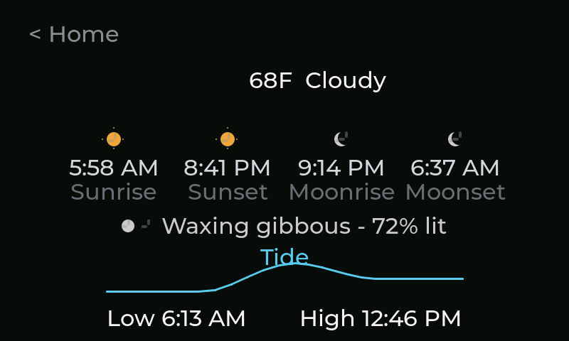
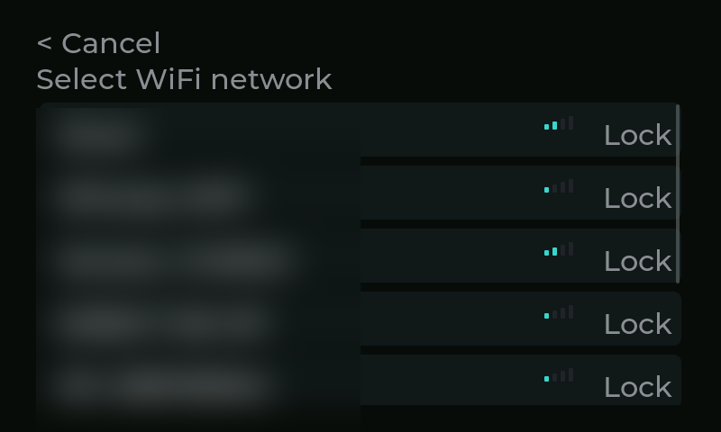
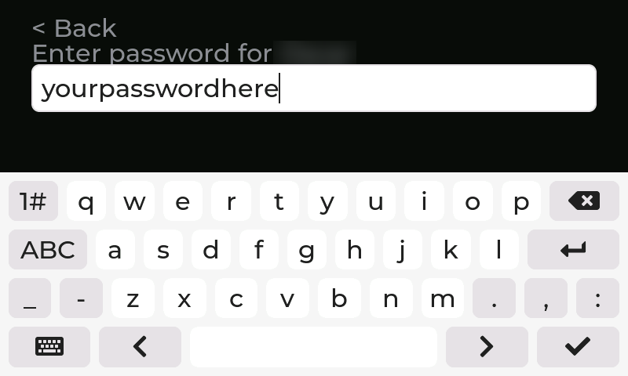
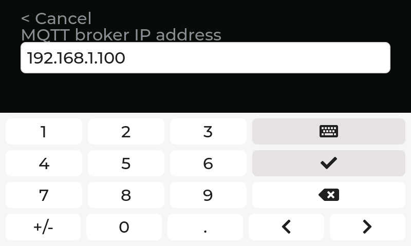

# Giga YH — Time-of-Use Power Controller

Home power flow arbitrated against time-of-use electricity rates that swing
as much as 8x between peak and off-peak. Two Arduino Giga R1 boards:

- **Unit 1 — controller** (`Giga_YH_Controller_LVGL_1.0.9.ino`): reads signed
  grid power from a Home Assistant current monitor and trims two Y-H
  grid-tied inverters (L1/L2 of a US split-phase 220V feed) over RS485 to
  keep grid export near zero. The Y-H hardware natively expects a
  downstream current-loop feed rather than the upstream panel reading the US
  grid actually requires, so the control math has to reconstruct a signed
  value from an absolute-value inverter interface. This is the
  safety/timing-critical loop — see [`CLAUDE.md`](CLAUDE.md) before touching
  it.
- **Unit 2 — dashboard** (`Giga_YH_Dashboard_Unit2/`): a second physical
  board, subscribe-only, no RS485, no publish, no control authority. Its job
  is purely to display what Unit 1 and Home Assistant are already doing —
  it structurally can't affect the control loop even if its own UI code is
  wrong. Everything below is this board.

## Unit 2 dashboard — overview

A touch-navigable 800×480 status display: a glanceable Home screen plus five
detail screens reachable by tapping. Built with LVGL on an Arduino Giga
Display Shield. Real data throughout — no more placeholders — including
live TOU rate/schedule, real per-line grid power over MQTT, a real battery
SoC curve, and NOAA tide predictions.

## Screens & interactions

**Home** — clock, weather, current TOU rate, connection status, battery
ring, and feeder/grid power at a glance. Tapping the weather pill opens
Almanac; the rate pill opens Time & rates; the battery ring, feeder, and
grid numbers each open their own detail screen.

**Time & rates** — the full day's on-peak/off-peak/super-off-peak schedule
as a color-coded bar, plus each tier's rate and which one is active now.

**Connection** — WiFi and MQTT broker status, signal strength, IP/router,
and firmware version. "Change WiFi" and "Change MQTT" open in-place setup
flows (below) for switching networks or brokers without a reflash.

**Battery** — charge percentage, charging/discharging state, and today's
SoC curve colored by charge vs. discharge.

**Grid** — battery and grid power rings, per-line (L1/L2) feeder and grid
breakdown, and today's/yesterday's savings.

**Almanac** (tap the weather pill on Home) — sunrise/sunset, moonrise/
moonset and phase, and a real tide curve (NOAA predictions for La Jolla).
Weather/moon-phase are still placeholder values, not yet wired to a real
source — see Future work.

### Changing WiFi or MQTT

From Connection, "Change WiFi" scans and lists nearby networks:

Tapping a secured network opens an on-screen keyboard for its password:

"Change MQTT" walks through broker IP, username, and password the same
way, each field prefilled with the current value for quick edits:

Both flows persist the new credentials on a successful connection and leave
the prior connection untouched on Cancel.

## Future work

- Wire the Almanac screen's weather and moon-phase display to a real
  source (Home Assistant's Moon integration only gives a discrete phase
  state, not illumination %; moonrise/moonset has no HA built-in and would
  need the same NOAA-precomputed-table approach already used for tide).
- Re-verify Unit 1's oscillation-fix halving logic against the confirmed
  understanding that `Line1Set`/`Line2Set` are independent signed per-line
  readings, not duplicates of one whole-household value (see `CLAUDE.md`).
- Unit 1: WiFi/MQTT boot failures still hang forever with no reconnect
  path; no reconnect logic if the link drops after `setup()`.
